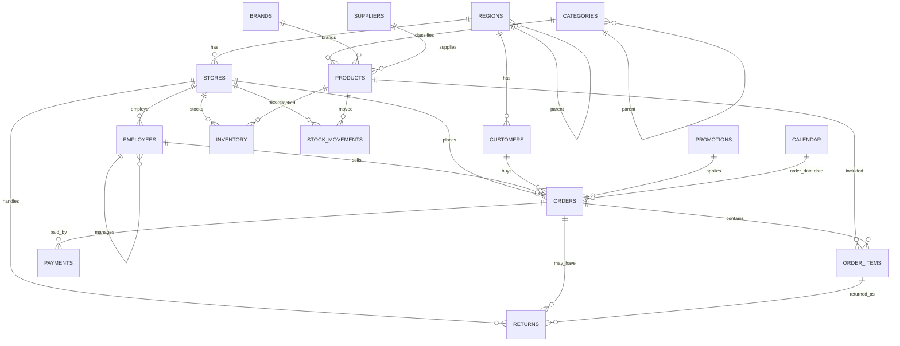

# 4. Database Design

## 4.1 Mục tiêu thiết kế

- Chuẩn hóa **3NF** cho operational/analytics hybrid schema
- Đủ entity cho bán lẻ multi-store
- Ràng buộc mạnh (CHECK, UNIQUE, FK) để bảo vệ data quality
- Index phục vụ filter dashboard & reporting
- Soft delete trên master data; transaction giữ lịch sử qua status
- Hỗ trợ SQL advanced: self-FK (employees, categories), calendar dimension

### Quy ước chung

| Quy ước | Chi tiết |
|---------|----------|
| PK | `id BIGSERIAL` (surrogate) trừ `calendar.date_id` / `calendar.full_date` |
| Natural key | `code` / `sku` / `order_number` UNIQUE |
| Timestamps | `created_at TIMESTAMPTZ NOT NULL DEFAULT now()`, `updated_at TIMESTAMPTZ NOT NULL DEFAULT now()` |
| Soft delete | `deleted_at TIMESTAMPTZ NULL` trên master tables |
| Money | `NUMERIC(18, 2)` |
| Quantity | `INTEGER` hoặc `NUMERIC(12, 3)` — chốt **INTEGER** cho retail unit count; fractional P2 |
| Naming | snake_case, bảng số nhiều |
| FK delete | Master: `RESTRICT`/`NO ACTION`; child cascade chỉ khi composition rõ (order_items theo orders) |
| Timezone | `TIMESTAMPTZ` (UTC storage) |
| Enum | PostgreSQL `ENUM` hoặc `TEXT + CHECK` — chốt **TEXT + CHECK** dễ Alembic |

### Trigger cập nhật `updated_at`

Một function dùng chung:

```text
set_updated_at() BEFORE UPDATE → NEW.updated_at = now()
```

Gắn cho mọi bảng có `updated_at`.

---

## 4.2 Danh sách bảng (16 entity + calendar)

1. `regions`  
2. `stores`  
3. `employees`  
4. `customers`  
5. `suppliers`  
6. `brands`  
7. `categories`  
8. `products`  
9. `promotions`  
10. `orders`  
11. `order_items`  
12. `payments`  
13. `inventory`  
14. `stock_movements`  
15. `returns`  
16. `calendar`  

---

## 4.3 Chi tiết từng bảng

### 4.3.1 `regions`

| Column | Type | Constraints |
|--------|------|-------------|
| id | BIGSERIAL | PK |
| code | VARCHAR(20) | NOT NULL, UNIQUE |
| name | VARCHAR(100) | NOT NULL |
| parent_id | BIGINT | NULL, FK → regions(id) |
| level | SMALLINT | NOT NULL DEFAULT 1, CHECK (level BETWEEN 1 AND 5) |
| created_at | TIMESTAMPTZ | NOT NULL DEFAULT now() |
| updated_at | TIMESTAMPTZ | NOT NULL DEFAULT now() |
| deleted_at | TIMESTAMPTZ | NULL |

**Indexes:** `ix_regions_parent_id`, `ix_regions_name`  
**Lý do:** phân cấp vùng (Miền → Tỉnh → Khu vực); recursive CTE demo.

---

### 4.3.2 `stores`

| Column | Type | Constraints |
|--------|------|-------------|
| id | BIGSERIAL | PK |
| code | VARCHAR(20) | NOT NULL, UNIQUE |
| name | VARCHAR(150) | NOT NULL |
| region_id | BIGINT | NOT NULL, FK → regions(id) |
| address | TEXT | NULL |
| city | VARCHAR(100) | NULL |
| phone | VARCHAR(30) | NULL |
| opened_at | DATE | NULL |
| is_active | BOOLEAN | NOT NULL DEFAULT TRUE |
| created_at | TIMESTAMPTZ | NOT NULL DEFAULT now() |
| updated_at | TIMESTAMPTZ | NOT NULL DEFAULT now() |
| deleted_at | TIMESTAMPTZ | NULL |

**Indexes:** `ix_stores_region_id`, `ix_stores_is_active`  
**Check:** nếu cần `opened_at <= CURRENT_DATE` (soft)

---

### 4.3.3 `employees`

| Column | Type | Constraints |
|--------|------|-------------|
| id | BIGSERIAL | PK |
| code | VARCHAR(20) | NOT NULL, UNIQUE |
| first_name | VARCHAR(100) | NOT NULL |
| last_name | VARCHAR(100) | NOT NULL |
| email | VARCHAR(255) | NULL, UNIQUE |
| phone | VARCHAR(30) | NULL |
| store_id | BIGINT | NOT NULL, FK → stores(id) |
| manager_id | BIGINT | NULL, FK → employees(id) |
| job_title | VARCHAR(100) | NOT NULL DEFAULT 'Sales Associate' |
| hire_date | DATE | NOT NULL |
| is_active | BOOLEAN | NOT NULL DEFAULT TRUE |
| created_at | TIMESTAMPTZ | NOT NULL DEFAULT now() |
| updated_at | TIMESTAMPTZ | NOT NULL DEFAULT now() |
| deleted_at | TIMESTAMPTZ | NULL |

**Indexes:** `ix_employees_store_id`, `ix_employees_manager_id`, `ix_employees_hire_date`  
**Check:** `manager_id IS DISTINCT FROM id` (không self-manage) — enforce app + optional trigger  
**Lý do self-FK:** org hierarchy, recursive CTE.

---

### 4.3.4 `customers`

| Column | Type | Constraints |
|--------|------|-------------|
| id | BIGSERIAL | PK |
| code | VARCHAR(30) | NOT NULL, UNIQUE |
| first_name | VARCHAR(100) | NOT NULL |
| last_name | VARCHAR(100) | NOT NULL |
| email | VARCHAR(255) | NULL, UNIQUE |
| phone | VARCHAR(30) | NULL |
| gender | VARCHAR(20) | NULL, CHECK (gender IN ('male','female','other','unknown')) |
| birth_date | DATE | NULL |
| address | TEXT | NULL |
| city | VARCHAR(100) | NULL |
| region_id | BIGINT | NULL, FK → regions(id) |
| registered_at | TIMESTAMPTZ | NOT NULL DEFAULT now() |
| is_active | BOOLEAN | NOT NULL DEFAULT TRUE |
| created_at | TIMESTAMPTZ | NOT NULL DEFAULT now() |
| updated_at | TIMESTAMPTZ | NOT NULL DEFAULT now() |
| deleted_at | TIMESTAMPTZ | NULL |

**Indexes:** `ix_customers_region_id`, `ix_customers_registered_at`, `ix_customers_phone`  
**Ghi chú:** walk-in customer có thể dùng 1 guest record hoặc email null.

---

### 4.3.5 `suppliers`

| Column | Type | Constraints |
|--------|------|-------------|
| id | BIGSERIAL | PK |
| code | VARCHAR(20) | NOT NULL, UNIQUE |
| name | VARCHAR(200) | NOT NULL |
| contact_name | VARCHAR(150) | NULL |
| email | VARCHAR(255) | NULL |
| phone | VARCHAR(30) | NULL |
| address | TEXT | NULL |
| rating | NUMERIC(3,2) | NULL, CHECK (rating BETWEEN 0 AND 5) |
| is_active | BOOLEAN | NOT NULL DEFAULT TRUE |
| created_at | TIMESTAMPTZ | NOT NULL DEFAULT now() |
| updated_at | TIMESTAMPTZ | NOT NULL DEFAULT now() |
| deleted_at | TIMESTAMPTZ | NULL |

**Indexes:** `ix_suppliers_name`, `ix_suppliers_is_active`

---

### 4.3.6 `brands`

| Column | Type | Constraints |
|--------|------|-------------|
| id | BIGSERIAL | PK |
| code | VARCHAR(20) | NOT NULL, UNIQUE |
| name | VARCHAR(150) | NOT NULL, UNIQUE |
| country | VARCHAR(100) | NULL |
| created_at | TIMESTAMPTZ | NOT NULL DEFAULT now() |
| updated_at | TIMESTAMPTZ | NOT NULL DEFAULT now() |
| deleted_at | TIMESTAMPTZ | NULL |

**Indexes:** `ix_brands_name`

---

### 4.3.7 `categories`

| Column | Type | Constraints |
|--------|------|-------------|
| id | BIGSERIAL | PK |
| code | VARCHAR(20) | NOT NULL, UNIQUE |
| name | VARCHAR(150) | NOT NULL |
| parent_id | BIGINT | NULL, FK → categories(id) |
| description | TEXT | NULL |
| created_at | TIMESTAMPTZ | NOT NULL DEFAULT now() |
| updated_at | TIMESTAMPTZ | NOT NULL DEFAULT now() |
| deleted_at | TIMESTAMPTZ | NULL |

**Indexes:** `ix_categories_parent_id`  
**Unique gợi ý:** UNIQUE (parent_id, name) WHERE deleted_at IS NULL (partial unique — optional)

---

### 4.3.8 `products`

| Column | Type | Constraints |
|--------|------|-------------|
| id | BIGSERIAL | PK |
| sku | VARCHAR(50) | NOT NULL, UNIQUE |
| name | VARCHAR(255) | NOT NULL |
| category_id | BIGINT | NOT NULL, FK → categories(id) |
| brand_id | BIGINT | NULL, FK → brands(id) |
| supplier_id | BIGINT | NULL, FK → suppliers(id) |
| unit_price | NUMERIC(18,2) | NOT NULL, CHECK (unit_price >= 0) |
| cost_price | NUMERIC(18,2) | NOT NULL, CHECK (cost_price >= 0) |
| description | TEXT | NULL |
| is_active | BOOLEAN | NOT NULL DEFAULT TRUE |
| created_at | TIMESTAMPTZ | NOT NULL DEFAULT now() |
| updated_at | TIMESTAMPTZ | NOT NULL DEFAULT now() |
| deleted_at | TIMESTAMPTZ | NULL |

**Indexes:**  
- `ix_products_category_id`  
- `ix_products_brand_id`  
- `ix_products_supplier_id`  
- `ix_products_name` (optional trigram later)  
**Check:** `cost_price <= unit_price * 2` (optional soft business) — **không** enforce cứng (clearance có thể bán lỗ). Chỉ `>= 0`.

---

### 4.3.9 `promotions`

| Column | Type | Constraints |
|--------|------|-------------|
| id | BIGSERIAL | PK |
| code | VARCHAR(30) | NOT NULL, UNIQUE |
| name | VARCHAR(150) | NOT NULL |
| discount_type | VARCHAR(20) | NOT NULL, CHECK (IN ('percent','fixed')) |
| discount_value | NUMERIC(18,2) | NOT NULL, CHECK (discount_value > 0) |
| min_order_amount | NUMERIC(18,2) | NULL, CHECK (min_order_amount >= 0) |
| start_date | DATE | NOT NULL |
| end_date | DATE | NOT NULL |
| is_active | BOOLEAN | NOT NULL DEFAULT TRUE |
| created_at | TIMESTAMPTZ | NOT NULL DEFAULT now() |
| updated_at | TIMESTAMPTZ | NOT NULL DEFAULT now() |
| deleted_at | TIMESTAMPTZ | NULL |

**Check:** `end_date >= start_date`  
**Check:** nếu `discount_type = 'percent'` thì `discount_value <= 100`  
**Indexes:** `ix_promotions_date_range` on (start_date, end_date), `ix_promotions_is_active`

---

### 4.3.10 `orders`

| Column | Type | Constraints |
|--------|------|-------------|
| id | BIGSERIAL | PK |
| order_number | VARCHAR(40) | NOT NULL, UNIQUE |
| customer_id | BIGINT | NOT NULL, FK → customers(id) |
| store_id | BIGINT | NOT NULL, FK → stores(id) |
| employee_id | BIGINT | NOT NULL, FK → employees(id) |
| promotion_id | BIGINT | NULL, FK → promotions(id) |
| order_date | TIMESTAMPTZ | NOT NULL |
| status | VARCHAR(20) | NOT NULL, CHECK (IN ('pending','paid','completed','cancelled')) |
| subtotal | NUMERIC(18,2) | NOT NULL DEFAULT 0, CHECK (subtotal >= 0) |
| discount_amount | NUMERIC(18,2) | NOT NULL DEFAULT 0, CHECK (discount_amount >= 0) |
| tax_amount | NUMERIC(18,2) | NOT NULL DEFAULT 0, CHECK (tax_amount >= 0) |
| total_amount | NUMERIC(18,2) | NOT NULL DEFAULT 0, CHECK (total_amount >= 0) |
| notes | TEXT | NULL |
| created_at | TIMESTAMPTZ | NOT NULL DEFAULT now() |
| updated_at | TIMESTAMPTZ | NOT NULL DEFAULT now() |

**Không soft-delete** order; hủy bằng `status = cancelled`.  
**Indexes:**  
- `ix_orders_customer_id`  
- `ix_orders_store_id`  
- `ix_orders_employee_id`  
- `ix_orders_order_date`  
- `ix_orders_status`  
- **Composite:** `ix_orders_store_date` (store_id, order_date)  
- **Composite:** `ix_orders_status_date` (status, order_date)  

**Ghi chú metric:** chỉ `status IN ('paid','completed')` tính revenue (chốt trong metric service).

---

### 4.3.11 `order_items`

| Column | Type | Constraints |
|--------|------|-------------|
| id | BIGSERIAL | PK |
| order_id | BIGINT | NOT NULL, FK → orders(id) ON DELETE CASCADE |
| product_id | BIGINT | NOT NULL, FK → products(id) |
| quantity | INTEGER | NOT NULL, CHECK (quantity > 0) |
| unit_price | NUMERIC(18,2) | NOT NULL, CHECK (unit_price >= 0) |
| unit_cost | NUMERIC(18,2) | NOT NULL, CHECK (unit_cost >= 0) |
| discount_amount | NUMERIC(18,2) | NOT NULL DEFAULT 0, CHECK (discount_amount >= 0) |
| line_total | NUMERIC(18,2) | NOT NULL, CHECK (line_total >= 0) |
| created_at | TIMESTAMPTZ | NOT NULL DEFAULT now() |
| updated_at | TIMESTAMPTZ | NOT NULL DEFAULT now() |

**Indexes:**  
- `ix_order_items_order_id`  
- `ix_order_items_product_id`  
- **Composite:** `ix_order_items_product_order` (product_id, order_id)  

**Business formula (app-enforced):**  
`line_total = quantity * unit_price - discount_amount`  
Optional CHECK khó vì expression; validate ở service/ETL.

---

### 4.3.12 `payments`

| Column | Type | Constraints |
|--------|------|-------------|
| id | BIGSERIAL | PK |
| payment_number | VARCHAR(40) | NOT NULL, UNIQUE |
| order_id | BIGINT | NOT NULL, FK → orders(id) ON DELETE RESTRICT |
| method | VARCHAR(30) | NOT NULL, CHECK (IN ('cash','card','transfer','e_wallet','other')) |
| amount | NUMERIC(18,2) | NOT NULL, CHECK (amount > 0) |
| status | VARCHAR(20) | NOT NULL, CHECK (IN ('pending','completed','failed','refunded')) |
| paid_at | TIMESTAMPTZ | NULL |
| created_at | TIMESTAMPTZ | NOT NULL DEFAULT now() |
| updated_at | TIMESTAMPTZ | NOT NULL DEFAULT now() |

**Indexes:** `ix_payments_order_id`, `ix_payments_paid_at`, `ix_payments_method`, `ix_payments_status`

---

### 4.3.13 `inventory`

| Column | Type | Constraints |
|--------|------|-------------|
| id | BIGSERIAL | PK |
| store_id | BIGINT | NOT NULL, FK → stores(id) |
| product_id | BIGINT | NOT NULL, FK → products(id) |
| quantity_on_hand | INTEGER | NOT NULL DEFAULT 0, CHECK (quantity_on_hand >= 0) |
| reorder_level | INTEGER | NOT NULL DEFAULT 0, CHECK (reorder_level >= 0) |
| max_level | INTEGER | NULL, CHECK (max_level IS NULL OR max_level >= reorder_level) |
| created_at | TIMESTAMPTZ | NOT NULL DEFAULT now() |
| updated_at | TIMESTAMPTZ | NOT NULL DEFAULT now() |

**Unique:** `uq_inventory_store_product` (store_id, product_id)  
**Indexes:** `ix_inventory_product_id`, `ix_inventory_low_stock` partial WHERE quantity_on_hand <= reorder_level (optional)

---

### 4.3.14 `stock_movements`

| Column | Type | Constraints |
|--------|------|-------------|
| id | BIGSERIAL | PK |
| store_id | BIGINT | NOT NULL, FK → stores(id) |
| product_id | BIGINT | NOT NULL, FK → products(id) |
| movement_type | VARCHAR(30) | NOT NULL, CHECK (IN ('purchase_in','sale_out','return_in','transfer_in','transfer_out','adjustment','damage_out')) |
| quantity | INTEGER | NOT NULL, CHECK (quantity <> 0) |
| reference_type | VARCHAR(30) | NULL |
| reference_id | BIGINT | NULL |
| note | TEXT | NULL |
| moved_at | TIMESTAMPTZ | NOT NULL DEFAULT now() |
| created_at | TIMESTAMPTZ | NOT NULL DEFAULT now() |
| updated_at | TIMESTAMPTZ | NOT NULL DEFAULT now() |

**Convention quantity:**  
- Inbound types: quantity **> 0**  
- Outbound types: quantity **< 0**  
Enforce bằng CHECK phức hợp hoặc application layer (khuyến nghị app + test).

**Indexes:**  
- `ix_stock_movements_store_product` (store_id, product_id)  
- `ix_stock_movements_moved_at`  
- `ix_stock_movements_type`  
- `ix_stock_movements_reference` (reference_type, reference_id)

---

### 4.3.15 `returns`

| Column | Type | Constraints |
|--------|------|-------------|
| id | BIGSERIAL | PK |
| return_number | VARCHAR(40) | NOT NULL, UNIQUE |
| order_id | BIGINT | NOT NULL, FK → orders(id) |
| order_item_id | BIGINT | NOT NULL, FK → order_items(id) |
| store_id | BIGINT | NOT NULL, FK → stores(id) |
| quantity | INTEGER | NOT NULL, CHECK (quantity > 0) |
| reason | VARCHAR(50) | NOT NULL, CHECK (IN ('defective','wrong_item','changed_mind','expired','other')) |
| refund_amount | NUMERIC(18,2) | NOT NULL DEFAULT 0, CHECK (refund_amount >= 0) |
| status | VARCHAR(20) | NOT NULL, CHECK (IN ('requested','approved','rejected','completed')) |
| returned_at | TIMESTAMPTZ | NOT NULL DEFAULT now() |
| created_at | TIMESTAMPTZ | NOT NULL DEFAULT now() |
| updated_at | TIMESTAMPTZ | NOT NULL DEFAULT now() |

**Indexes:** `ix_returns_order_id`, `ix_returns_order_item_id`, `ix_returns_store_id`, `ix_returns_returned_at`, `ix_returns_status`  
**Rule:** `quantity` ≤ original order_item.quantity (app/trigger)

---

### 4.3.16 `calendar`

| Column | Type | Constraints |
|--------|------|-------------|
| date_id | INTEGER | PK (YYYYMMDD) |
| full_date | DATE | NOT NULL, UNIQUE |
| year | SMALLINT | NOT NULL |
| quarter | SMALLINT | NOT NULL, CHECK (quarter BETWEEN 1 AND 4) |
| month | SMALLINT | NOT NULL, CHECK (month BETWEEN 1 AND 12) |
| month_name | VARCHAR(20) | NOT NULL |
| week_of_year | SMALLINT | NOT NULL, CHECK (week_of_year BETWEEN 1 AND 53) |
| day_of_month | SMALLINT | NOT NULL |
| day_of_week | SMALLINT | NOT NULL, CHECK (day_of_week BETWEEN 1 AND 7) |
| day_name | VARCHAR(20) | NOT NULL |
| is_weekend | BOOLEAN | NOT NULL |
| is_holiday | BOOLEAN | NOT NULL DEFAULT FALSE |
| holiday_name | VARCHAR(100) | NULL |
| fiscal_year | SMALLINT | NULL |
| fiscal_quarter | SMALLINT | NULL |

**Indexes:** `ix_calendar_year_month` (year, month), `ix_calendar_year_quarter` (year, quarter)  
**Phạm vi seed:** ví dụ 2020-01-01 → 2030-12-31  
**Join pattern:** `orders.order_date::date = calendar.full_date`

Không cần `created_at`/`deleted_at` (static dimension); có thể thêm `created_at` optional.

---

## 4.4 ERD (Logical)

```text
                          ┌─────────────┐
                          │   regions   │
                          │  (self-FK)  │
                          └──────┬──────┘
                                 │ 1
                    ┌────────────┼────────────┐
                    │ N          │ N          │ N
              ┌─────▼────┐ ┌─────▼────┐ ┌─────▼──────┐
              │  stores  │ │customers │ │ (optional) │
              └─────┬────┘ └─────┬────┘ └────────────┘
                    │ 1          │ 1
          ┌─────────┼────────┐   │
          │ N       │ N      │   │
    ┌─────▼────┐ ┌──▼──────┐ │   │
    │employees │ │inventory│ │   │
    │ (self-FK)│ └──┬──────┘ │   │
    └─────┬────┘    │        │   │
          │         │ N      │   │
          │    ┌────▼────────┴───┴──────────┐
          │    │ products ◄── categories    │
          │    │    │  ▲   (self-FK parent) │
          │    │    │  │                    │
          │    │    │  └── brands           │
          │    │    │  └── suppliers        │
          │    └────┼───────────────────────┘
          │         │
          │    stock_movements
          │
          │ 1               1
     ┌────▼─────────────────▼────┐
     │          orders            │────── promotions (0..1)
     │ customer, store, employee  │
     └───────┬──────────┬─────────┘
             │ 1        │ 1
        ┌────▼────┐ ┌───▼────┐
        │order_   │ │payments│
        │items    │ └────────┘
        └────┬────┘
             │ 1
        ┌────▼────┐
        │ returns │
        └─────────┘

     calendar ──(date)── orders.order_date::date
```

### Cardinality tóm tắt

| Quan hệ | Cardinality |
|---------|-------------|
| regions → stores | 1:N |
| regions → customers | 1:N |
| regions → regions | 1:N (tree) |
| stores → employees | 1:N |
| stores → orders | 1:N |
| stores → inventory | 1:N |
| employees → employees | 1:N (manager) |
| employees → orders | 1:N |
| customers → orders | 1:N |
| categories → categories | 1:N |
| categories → products | 1:N |
| brands → products | 1:N |
| suppliers → products | 1:N |
| products → order_items | 1:N |
| products → inventory | 1:N |
| products → stock_movements | 1:N |
| promotions → orders | 1:N |
| orders → order_items | 1:N |
| orders → payments | 1:N |
| orders → returns | 1:N |
| order_items → returns | 1:N |

---

## 4.5 Giải thích lý do thiết kế

### 4.5.1 Vì sao 3NF operational thay vì star schema thuần?

- Dự án luyện **SQL join thật**, constraint, ETL load master + facts.
- Vẫn hỗ trợ BI bằng **calendar dimension** + reporting SQL.
- Nếu cần performance report cực nặng sau này: có thể thêm **materialized views** (P2, không bắt buộc phase 1).

### 4.5.2 Snapshot giá trên `order_items`

Giá `products.unit_price` đổi theo thời gian. Lưu `unit_price`/`unit_cost` trên dòng đơn đảm bảo lịch sử doanh thu/profit **không bị rewrite**.

### 4.5.3 Money trên header + lines

`orders.subtotal/total` denormalize nhẹ để dashboard nhanh; **source of truth dòng** là `order_items`. Reconciliation query trong SQL roadmap kiểm tra lệch.

### 4.5.4 Soft delete master

Tránh mất FK history khi “xóa” product/customer. Transaction tables không soft-delete.

### 4.5.5 `stock_movements` vs chỉ `inventory`

Inventory là snapshot; movements là ledger — hỗ trợ audit và phân tích xuất nhập.

### 4.5.6 `returns` tách bảng

Return không phải negative order_item im lặng — cần reason, status, refund riêng; join để tính net revenue.

### 4.5.7 Self-FK `employees.manager_id` & `categories.parent_id`

Phục vụ **recursive CTE** trong learning path.

---

## 4.6 Views gợi ý (implement phase SQL/ETL)

| View | Mục đích |
|------|----------|
| `v_order_lines_enriched` | order_items + orders + product + category + store |
| `v_daily_sales` | revenue/profit theo ngày |
| `v_inventory_status` | on_hand, reorder flag |
| `v_customer_order_stats` | frequency, monetary, last_order |

---

## 4.7 Index strategy tóm tắt

| Pattern | Index |
|---------|-------|
| FK columns | B-tree đơn |
| Dashboard date filter | order_date; (store_id, order_date) |
| Product sales | (product_id) on order_items; join orders for date |
| Status filter | (status, order_date) |
| Low stock | partial index inventory |
| Covering (P2) | include columns sau EXPLAIN |

Chi tiết bài tập index nằm trong `sql-roadmap.md` phần Optimization.

---

## 4.8 Migration plan (Alembic) — không code, chỉ thứ tự

1. Extensions (nếu cần): none bắt buộc  
2. regions → stores → employees  
3. suppliers, brands, categories → products  
4. customers, promotions, calendar  
5. orders → order_items → payments  
6. inventory, stock_movements, returns  
7. indexes phụ & partial indexes  
8. trigger `set_updated_at`

---

## 4.9 Sample business rules (enforce layers)

| Rule | Layer |
|------|-------|
| PK/FK/CHECK/UNIQUE | Database |
| line_total formula | Service + ETL validation |
| return qty ≤ order qty | Service + SQL test |
| payment sum vs order total | Service (warning if partial) |
| revenue status filter | Metrics module |
| deleted_at filter | Repository default |

---

## 4.10 ERD file artifacts (khi implement)

Khi code phase DB, có thể bổ sung:

- `docs/erd.mmd` (Mermaid)
- `docs/erd.png` (export thủ công)

Phiên bản Mermaid tham chiếu:



---

## 4.11 Checklist thiết kế DB

- [x] 16 bảng + calendar  
- [x] PK/FK đầy đủ  
- [x] UNIQUE natural keys  
- [x] CHECK constraints chính  
- [x] Index & composite đề xuất  
- [x] Soft delete policy  
- [x] Snapshot pricing  
- [x] Self-FK cho recursive CTE  
- [x] ERD textual + Mermaid  
